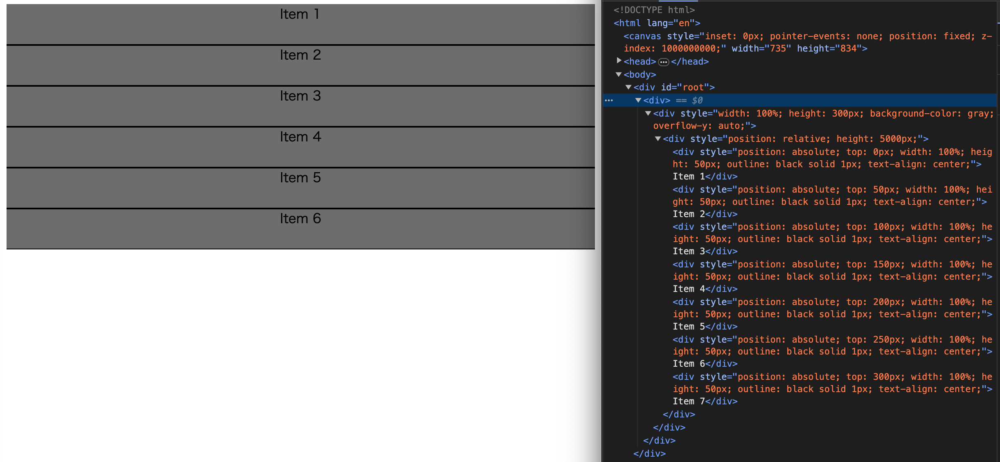
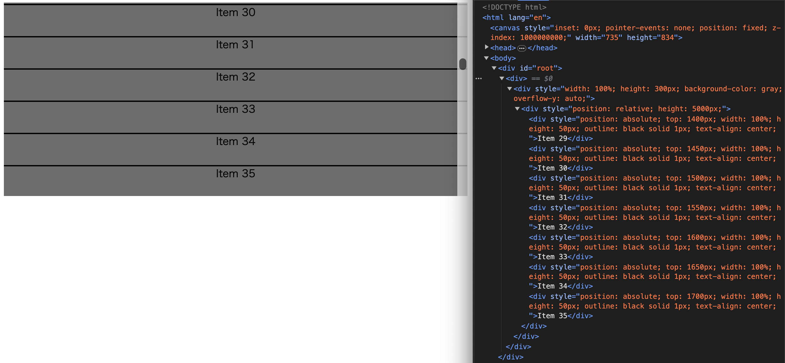

# react-window-copy

## 自身の学習のために、React-Window というライブラリを自分なりに再現してみました。

React-Window というライブラリは大量のデータリストを表示しなければならなくった際、全てのデータリストをレンダリングするのではなく、画面に表示される領域のみをレンダリングすることを可能にするというものです。

以前、このライブラリを使用したことがあったのですが、最近になって、「あの機能をどのように実現しているのだろうか」と気になりました。そこで、非常に簡素なものではありますが、自分で画面に表示される領域のみをレンダリングする機能を開発してみることにしました。

## 最終的なコード

```
import { useRef, useState, useEffect, useMemo } from "react";
import { Props } from "./types";

const InfiniteScroll = ({ itemLength, itemSize, height, children }: Props) => {
  // コンテナ要素のためのrefを作成
  const containerRef = useRef<HTMLDivElement>(null);

  // どこからどこまでの要素をレンダリングするかを決定するためのStateを宣言
  const [startIndex, setStartIndex] = useState(0);
  const [stopIndex, setStopIndex] = useState(height / itemSize);

  // スクロールイベントをアタッチし、上に書いたStateを更新
  useEffect(() => {
    const container = containerRef.current;

    const handleScroll = () => {
      const scrollTop = container!.scrollTop;
      const start = Math.floor(scrollTop / itemSize);
      const stop = Math.floor((scrollTop + container!.clientHeight) / itemSize);

      setStartIndex(start);
      setStopIndex(stop);
    };

    container?.addEventListener("scroll", handleScroll);
    return () => {
      container?.removeEventListener("scroll", handleScroll);
    };
  }, [itemLength, itemSize]);

  // 画面内に表示する要素を抜き出す
  const visibleItems = useMemo(() => {
    console.log("rendered!"); // レンダリング時にコンソールログを出力
    return (children as Array<string>).slice(startIndex, stopIndex + 1);
  }, [startIndex, stopIndex]);

  return (
    <div
      ref={containerRef}
      style={{
        width: "100%",
        height: `${height}px`,
        backgroundColor: "gray",
        overflowY: "auto",
      }}
    >
      <div
        style={{ position: "relative", height: `${itemLength * itemSize}px` }}
      >
        {visibleItems.map((item, index) => (
          <div
            key={item}
            style={{
              position: "absolute",
              top: `${startIndex * itemSize + index * itemSize}px`,
              width: "100%",
              height: `${itemSize}px`,
              outline: "1px solid black",
              textAlign: "center",
            }}
          >
            {item}
          </div>
        ))}
      </div>
    </div>
  );
};

export default InfiniteScroll;

```

上記のコードは以下のように呼び出せます
```
import InfiniteScroll from "./infiniteScroll";

const App = () => {
  const largeArray = Array.from({ length: 100 }, (_, index) => ({
    content: `Item ${index + 1}`,
  }));
  return (
    <div>
      <InfiniteScroll itemSize={50} itemLength={largeArray.length} height={300}>
        {largeArray.map((item) => item.content)}
      </InfiniteScroll>
    </div>
  );
};

export default App;
```

上記の例では100個の配列を作り出していますが、実際にレンダリングされるのは常に6個となります。

初期レンダリング時



30個目の配列までスクロールした際の画像


どちらも、画像の右側に写っている開発者ツールを見ると、100個の配列の内、6つ分の配列しかレンダリングされていないことがわかると思います